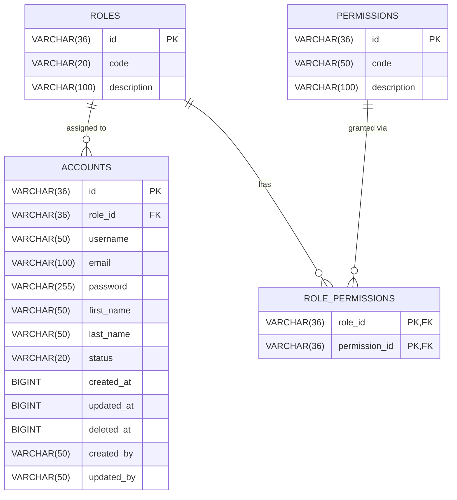

# Entity-Relationship Diagram — Account Manager Service

This diagram represents the database schema of the `account-manager` microservice, derived from its
Spring Data R2DBC entity classes (`@Table`, `@Id`, `@Column`) located in
`account-manager/account-manager-data/src/main/java/com/bycrafter/accountmanager/data/entity`
and the Flyway migration scripts under
`account-manager/account-manager-app/src/main/resources/db/migration`.

## Diagram (Crow's Foot Notation)

## Entity Notes

- **ROLES**: RBAC role definitions (`Role.java`, table `roles`). Referenced by `AccountRole` enum via `RoleCache`.
- **PERMISSIONS**: Individual permission codes (`Permission.java`, table `permissions`).
- **ROLE_PERMISSIONS**: Join table implementing the many-to-many relationship between `ROLES` and `PERMISSIONS` (`RolePermission.java`), composite primary key `(role_id, permission_id)`.
- **ACCOUNTS**: Core user/account entity (`Account.java`, table `accounts`). `role_id` is a nullable foreign key to `ROLES`, hence the zero-or-many relationship. `status` maps to the `AccountStatus` enum (`PENDING`, `VERIFIED`, `PASSIVE`).

## Relationship Legend

| Notation | Meaning |
|---|---|
| `||--o{` | One-to-Zero-or-Many |
| `||--|{` | One-to-One-or-Many |
| `}o--o{` | Many-to-Many |
