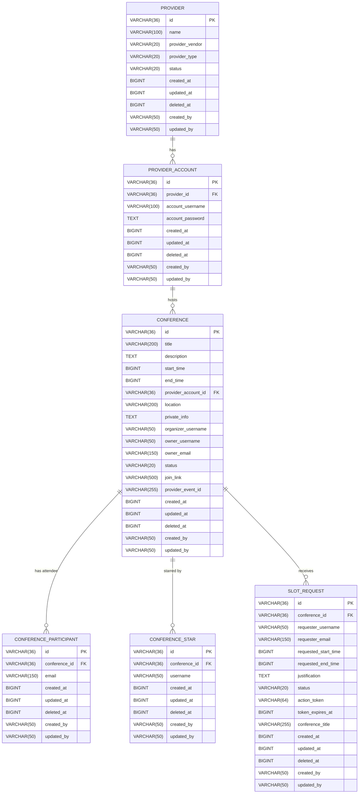

# Entity-Relationship Diagram — Conference Manager Service

This diagram represents the database schema of the `conference-manager` microservice, derived from its
Spring Data R2DBC entity classes (`@Table`, `@Id`, `@Column`) located in
`conference-manager/conference-manager-data/src/main/java/com/bycrafter/conferencemanager/data/entity`
and the Flyway migration scripts under
`conference-manager/conference-manager-app/src/main/resources/db/migration`.

## Diagram (Crow's Foot Notation)

## Entity Notes

- **PROVIDER**: A conferencing platform provider, e.g. Zoom/Google Meet (`Provider.java`, table `provider`). `provider_vendor` and `provider_type` map to the `ProviderVendor`/`ProviderType` enums.
- **PROVIDER_ACCOUNT**: A credentialed account with a `PROVIDER` (`ProviderAccount.java`, table `provider_account`), `provider_id` is a required foreign key. `account_password` is stored as AES-256-GCM ciphertext (`EncryptionUtil`).
- **CONFERENCE**: The core scheduled meeting entity (`Conference.java`, table `conference`). Requires a `provider_account_id` (the account used to create/host the meeting). `status` maps to `ConferenceStatus` (default `SCHEDULED`).
- **CONFERENCE_PARTICIPANT**: Attendee of a conference identified by e-mail (`ConferenceParticipant.java`, table `conference_participant`); unique per `(conference_id, email)`.
- **CONFERENCE_STAR**: Marks a conference as "starred"/favorited by a given user (`ConferenceStar.java`, table `conference_star`); unique per `(conference_id, username)`.
- **SLOT_REQUEST**: A request to reserve/extend a time slot on a conference (`SlotRequest.java`, table `slot_request`). `status` maps to `SlotRequestStatus` (default `PENDING`); `action_token` is unique when present.

## Relationship Legend

| Notation | Meaning |
|---|---|
| `||--o{` | One-to-Zero-or-Many |
| `||--|{` | One-to-One-or-Many |
| `||--||` | One-to-One |
| `}o--o{` | Many-to-Many |
