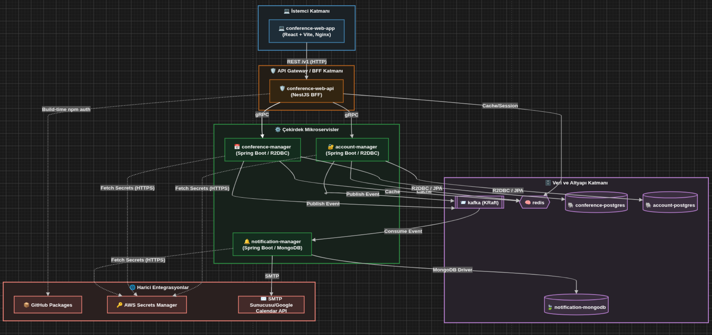

# YACS (Video Conference Management System) — Yüksek Seviye Tasarım (HLD) Dokümanı

> Bu doküman, `crafter-infra` reposundaki `docker-compose.yml`, alt (sibling) servis referansları, ortam değişkenleri (`.env`) ve yardımcı script'ler (`start-infra.sh`, `docker-image-build.sh`, `lib-infra.sh`) incelenerek; platformun gerçek altyapı durumuna dayalı olarak hazırlanmıştır.

## 1. Mimari Vizyon

YACS platformu, **Mikroservis Mimarisi (Microservices Architecture)** ve **Olay Güdümlü Mimari (Event-Driven Architecture)** prensiplerinin bir arada kullanıldığı, çok dilli (polyglot) bir sistemdir.

- **Mikroservisler**: Her bir iş yeteneği (hesap/kimlik yönetimi, konferans yönetimi, bildirim yönetimi) kendi veritabanına, kendi teknoloji yığınına ve kendi deployment yaşam döngüsüne sahip bağımsız servisler olarak tasarlanmıştır. `account-manager` ve `conference-manager` Spring Boot (reaktif, R2DBC) üzerine, `notification-manager` ise Spring Boot + MongoDB üzerine inşa edilmiştir.
- **Backend-for-Frontend (BFF) Deseni**: `conference-web-api` (NestJS), istemciye özel bir ağ geçidi (gateway) görevi görür; frontend'den gelen REST isteklerini karşılar, bunları arka plandaki çekirdek servislere **gRPC** çağrılarına dönüştürür ve devre kesici (circuit breaker), throttling gibi dayanıklılık (resilience) desenlerini uygular.
- **Olay Güdümlü İletişim**: Servisler arası zayıf bağlılığı (loose coupling) sağlamak amacıyla `account-manager`, `conference-manager` ve `notification-manager` **Apache Kafka** (KRaft modu, tek broker) üzerinden asenkron olay (event) alışverişi yapar. Örneğin bir konferans oluşturulduğunda yayınlanan olay, `notification-manager` tarafından tüketilerek e-posta/bildirim gönderimini tetikler.
- **Merkezi Konfigürasyon ve Sır Yönetimi**: Tüm Java servisleri, kimlik bilgilerini ve hassas konfigürasyonları doğrudan kod veya `.env` içinde tutmak yerine, uygulama açılışında **AWS Secrets Manager**'dan (`spring.config.import: aws-secretsmanager:...`) çeker.
- **Gözlemlenebilirlik (Observability)**: **Zipkin**, servisler arası dağıtık izleme (distributed tracing) için kullanılır ve istek zincirinin farklı mikroservisler üzerinden nasıl ilerlediğinin görselleştirilmesini sağlar.
- **Konteynerizasyon**: Tüm bileşenler Docker Compose ile orkestre edilir; `crafter-infra` reposu bizzat uygulama kodu barındırmaz, sadece build context'lerini, network topolojisini ve ortam değişkenlerini tek noktadan yönetir (kardeş repo'lar: `account-manager`, `conference-manager`, `notification-manager`, `conference-web-api`, `conference-web-app`).

## 2. Mantıksal Bileşenler

### 2.1 İstemci Katmanı (Client Layer)
| Bileşen | Rol | Teknoloji |
|---|---|---|
| `conference-web-app` | Kullanıcıların etkileşimde bulunduğu Single Page Application (SPA). Statik dosyalar Nginx üzerinden sunulur ve `/v1/*` altındaki API çağrıları Nginx reverse-proxy konfigürasyonu ile BFF'e yönlendirilir. | React + Vite, Nginx |

### 2.2 API Gateway / BFF Katmanı
| Bileşen | Rol | Teknoloji |
|---|---|---|
| `conference-web-api` | Frontend'e özel API Gateway (BFF). Gelen REST isteklerini `account-manager` ve `conference-manager`'a gRPC çağrılarına dönüştürür; devre kesici, timeout, throttling gibi dayanıklılık mekanizmalarını uygular; Redis üzerinden oturum/cache yönetimi yapar. | NestJS (Node.js) |

### 2.3 Çekirdek Mikroservisler (Core Domain)
| Bileşen | Rol | Teknoloji |
|---|---|---|
| `account-manager` | Kullanıcı hesabı, kimlik doğrulama/yetkilendirme (auth) işlemlerini yönetir. BFF'e gRPC servisi sunar, Kafka'ya olay yayınlar. | Spring Boot (reaktif), R2DBC, gRPC, Kafka |
| `conference-manager` | Konferans/toplantı oluşturma, planlama ve yönetim iş mantığını içerir. Hassas veriler için (`master_encryption_key`) uygulama seviyesinde şifreleme kullanır. | Spring Boot (reaktif), R2DBC, gRPC, Kafka |
| `notification-manager` | Kafka üzerinden gelen olayları (örn. konferans daveti, hatırlatma) dinleyerek e-posta/bildirim gönderimini gerçekleştirir; kayıtları MongoDB'de tutar. | Spring Boot, MongoDB, Kafka, SMTP |

### 2.4 Veri ve Altyapı Katmanı (Data & Infrastructure Layer)
| Bileşen | Rol |
|---|---|
| `account-postgres` | `account-manager` için ilişkisel veritabanı (hesap/kimlik verileri). |
| `conference-postgres` | `conference-manager` için ilişkisel veritabanı (konferans verileri). |
| `notification-mongodb` | `notification-manager` için doküman veritabanı (bildirim geçmişi/şablonları). |
| `redis` | `account-manager`, `conference-manager` ve `conference-web-api` tarafından paylaşılan önbellek (cache) ve oturum deposu. |
| `kafka` (KRaft, tek broker) | Servisler arası asenkron olay yayınlama/tüketme için mesaj aracısı (message broker). |
| `zipkin` | Dağıtık izleme (distributed tracing) arayüzü; servisler arası istek akışının gözlemlenmesini sağlar. |
| AWS Secrets Manager | Java servislerinin (account/conference/notification-manager) veritabanı, Redis ve diğer hassas konfigürasyonlarını çalışma zamanında merkezi olarak temin ettiği harici sır deposu. |

### 2.5 Harici Entegrasyonlar (External Integrations)
| Bileşen | Rol |
|---|---|
| SMTP Sunucusu | `notification-manager`'ın kullanıcılara e-posta bildirimleri (davet, hatırlatma vb.) göndermesi için kullanılır (`sender_email` / `sender_email_app_password`). |
| GitHub Packages | `conference-web-api` imajının build aşamasında özel `@bycrafter/*-grpc-contract` npm paketlerinin çekilmesi için kullanılır (`NODE_AUTH_TOKEN`). |
| AWS Secrets Manager | Java servislerinin çalışma zamanı konfigürasyon/sır kaynağı (aynı zamanda altyapı katmanının bir parçasıdır). |

## 3. İletişim Protokolleri

Sistemde iki temel iletişim modeli kullanılmaktadır:

- **Senkron İletişim (Synchronous)**
  - **HTTP/REST**: `conference-web-app` (istemci) ↔ `conference-web-api` (BFF) arasında; ayrıca Nginx reverse-proxy üzerinden `/v1/*` yolu ile.
  - **gRPC**: `conference-web-api` (BFF) ↔ `account-manager` / `conference-manager` (çekirdek servisler) arasında; düşük gecikmeli, tip güvenli (contract-first, `@bycrafter/*-grpc-contract` paketleri ile) iletişim sağlar.
  - **JPA/R2DBC (SQL)**: `account-manager` ↔ `account-postgres`, `conference-manager` ↔ `conference-postgres` arasında reaktif veritabanı erişimi.
  - **MongoDB Driver**: `notification-manager` ↔ `notification-mongodb` arasında doküman tabanlı veri erişimi.
  - **Redis Protokolü**: `account-manager`, `conference-manager`, `conference-web-api` ↔ `redis` arasında cache/oturum okuma-yazma.
  - **HTTPS (AWS SDK)**: Java servisleri ↔ AWS Secrets Manager arasında konfigürasyon/sır çekimi (açılışta).
  - **SMTP**: `notification-manager` ↔ harici SMTP sunucusu arasında e-posta gönderimi.

- **Asenkron İletişim (Asynchronous — Event-Driven)**
  - **Kafka (Publish/Subscribe)**: `account-manager` ve `conference-manager`, iş olaylarını (örn. `ConferenceCreated`, `UserRegistered`) Kafka topic'lerine **yayınlar (publish)**; `notification-manager` bu olayları **tüketerek (consume)** bildirim/e-posta gönderim sürecini tetikler. Bu model, servisler arasında zamansal ve teknolojik bağımsızlık sağlar.

- **Gözlemlenebilirlik İletişimi**: Tüm servisler, dağıtık iz (trace) verilerini `zipkin`'e raporlar; bu da uçtan uca istek takibini mümkün kılar.

## 4. Mimari Diyagram

### Diyagram Notları
- **Katı çizgiler (`-->`)**: senkron iletişimi (REST, gRPC, veritabanı sürücüleri) temsil eder.
- **Kesikli çizgiler (`-.->`)**: opsiyonel/açılış zamanı (startup-time) veya izleme (tracing) amaçlı iletişimi temsil eder.
- **`kafka`** düğümü, olay güdümlü mimarinin merkezinde yer alır; `account-manager` ve `conference-manager` olay üreticisi (producer), `notification-manager` ise olay tüketicisidir (consumer).
- Her uygulama servisi ayrıca `host.docker.internal` üzerinden geliştirici makinesine (IDE'den debug amaçlı çalıştırılan servislere) erişebilecek şekilde yapılandırılmıştır; bu, geliştirme/debug senaryosu olduğu için ana mimari diyagramına dahil edilmemiştir.
